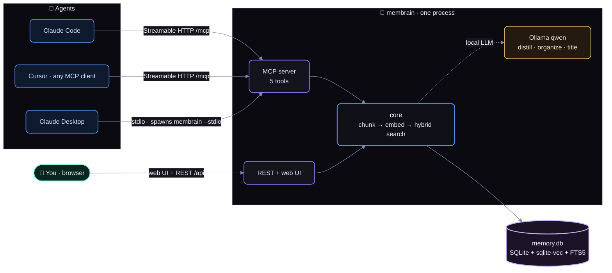
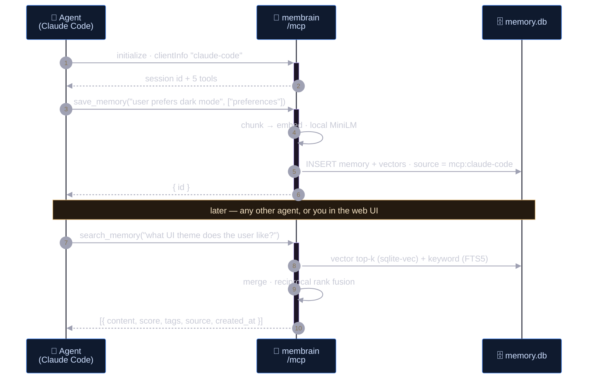

<p align="center"></p>

# Membrain

**One memory, every AI.** Self-hosted, single-user memory server. You (web UI) and your AI agents (MCP) share one memory store — everyone reads, everyone writes. One SQLite file, no accounts, no cloud.

## Quickstart (5 minutes)

```bash
npm install
npm run build
npm start
```

- **Web UI** → http://127.0.0.1:7777
- **MCP (Streamable HTTP)** → `http://127.0.0.1:7777/mcp`
- **REST** → `http://127.0.0.1:7777/api/memories`

First start downloads the local embedding model (all-MiniLM, ~80 MB) into `data/models/` — after that everything runs fully offline. All data lives in `data/memory.db`. Copy it = backup. Delete it = gone.

### Connect your agents

Full walkthrough for Claude Code, Claude Desktop, Cursor, stdio clients, and scripts: **[docs/connect-agents.md](docs/connect-agents.md)**. Short version:

```bash
claude mcp add --transport http membrain http://127.0.0.1:7777/mcp
```

Then install the **membrain skill** ([skills/membrain/SKILL.md](skills/membrain/SKILL.md)) into `~/.claude/skills/membrain/` or `~/.agents/skills/membrain/` so agents search and save memory *unprompted*, not just when asked. Manage it later from the web UI's Skills tab.

## How the MCP works



Every writer goes through the same core — an agent's memory and yours are indistinguishable except for the recorded `source`.



### MCP tools

| Tool | Does |
|---|---|
| `save_memory(content, tags?)` | store a durable fact |
| `save_memories(memories[])` | store several facts in one call |
| `search_memory(query, top_k?, tags?)` | hybrid semantic + keyword search, recency-boosted |
| `get_memory(id)` | fetch one memory in full |
| `update_memory(id, content?, tags?)` | edit a memory |
| `delete_memory(id)` | remove a memory |
| `list_memories(limit?, tag?)` | recent memories |
| `memory_context(query?, top_k?)` | one-call session-start digest of what's known |

## Web UI — the memory ledger

Paper-and-ink archival design, its own identity: ruled ledger entries, serif headings, per-writer ink stamps, an index rail, a night-ledger dark mode.

- **Memories** — hybrid search (sqlite-vec + FTS5, RRF-merged, recency-boosted), ledger/cards/topics views, tag + writer filters, multi-select, right-hand drawer to read and manage each entry.
- **The clerk** (needs local Ollama) — *Organize* files the store into topics incrementally with a live progress bar (topics appear as it works), *Titles* drafts one entry at a time, *Summarize* works on any scope, *Duplicates* finds near-identical entries by vector similarity (no LLM, instant) for one-click strike.
- **AI proposal queue** — every change membrain's own LLM wants to make to a live memory is staged for accept/reject. Nothing is inked silently.
- **Reviewed imports** — dropped PDFs/MD/TXT are extracted into candidate entries you review, edit, and selectively file before anything is saved.
- **Map** — the atlas: an entity/relationship constellation of everything the store knows, drawn by the local LLM. Visualization only, never used for retrieval.
- **Backup** — snapshot on every boot (keeps 5), one-click SQLite snapshot, JSON export/import of memories and skills, selective export.
- **Skills** — manage agent skills on disk (`~/.claude/skills` + `~/.agents/skills`): markdown preview/code editor, create, download, delete. `--readonly-skills` locks them.
- **Agent Import** — finds pre-existing agent memory on your machine, tracks what's already filed (content-hash), updates changed files instead of duplicating.
- **Settings** — everything configurable from the UI; no config files.

## LLM-assisted import (Ollama)

If a local [Ollama](https://ollama.com) is running, imported documents are distilled by it: the text is windowed and each window's key points are extracted and saved as individual memories. No Ollama → the raw text is saved as one chunked memory. Import always works offline.

Settings (edit in the UI's Settings tab, stored in the `settings` table):

| Key | Default | Meaning |
|---|---|---|
| `ollama_url` | `http://127.0.0.1:11434` | Ollama endpoint |
| `ollama_model` | first installed model | model used for extraction |
| `import_llm` | on | set `off` to always import raw |
| `embedding_provider` | `local` | `api` for an OpenAI-compatible endpoint (`embedding_api_url`, `embedding_api_model`, `embedding_api_key`) |
| `skill_roots` | `~/.claude/skills` + `~/.agents/skills` | named skill directories |
| `agent_memory_dirs` | `[]` | extra dirs scanned for agent memory files |

Changing the embedding model re-embeds every chunk on next boot — models are never mixed.

## CLI flags

```
membrain [--port 7777] [--host 127.0.0.1] [--data ./data] [--stdio] [--readonly-skills]
```

## Docker

```bash
docker build -t membrain .
docker run -p 127.0.0.1:7777:7777 -v membrain-data:/app/data membrain
```

Keep the port binding on `127.0.0.1` — the container boundary is not an auth layer.

## ⚠️ Security

**There is no auth. Anywhere. By design.** Security is the network boundary: the default bind is `127.0.0.1`. Never expose Membrain to a public interface — anyone who can reach the port owns your memory (and can write files into your skill directories). Binding non-localhost requires the explicit flag pair:

```
membrain --host 0.0.0.0 --i-understand-no-auth
```

Only do that on an interface you trust end-to-end (Tailscale, WireGuard, private LAN).

## Development

```bash
npm run dev        # server with tsx (UI needs a build first, or run vite separately)
npm test           # vitest — real SQLite in temp dirs, fake embedder, no network
npm run typecheck
```

## Docs

- **[docs/connect-agents.md](docs/connect-agents.md)** — add Membrain to Claude Code, Claude Desktop, Cursor, any MCP client; verify the shared-memory loop.
- **[skills/membrain/SKILL.md](skills/membrain/SKILL.md)** — the skill that teaches agents to use memory unprompted.
- **[docs/membrain-prd.md](docs/membrain-prd.md)** — product spec.
- **[CLAUDE.md](CLAUDE.md)** — architecture and working rules for this repo.
